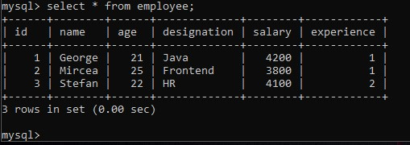

# EmployeesDatabase

[](https://forthebadge.com)

## Description
Project built using JDBC with MySQL 🐬  in IntelliJ. Managing the database containing employees of a company. Mainly for pratice purposes.

## How to run
* Connect to database: View -> Tool Windows -> Database -> Data Source -> MySQL -> ...
* Add in Libraries the ```MySQL Connector/J``` .jar.

## Gallery - Database structure

